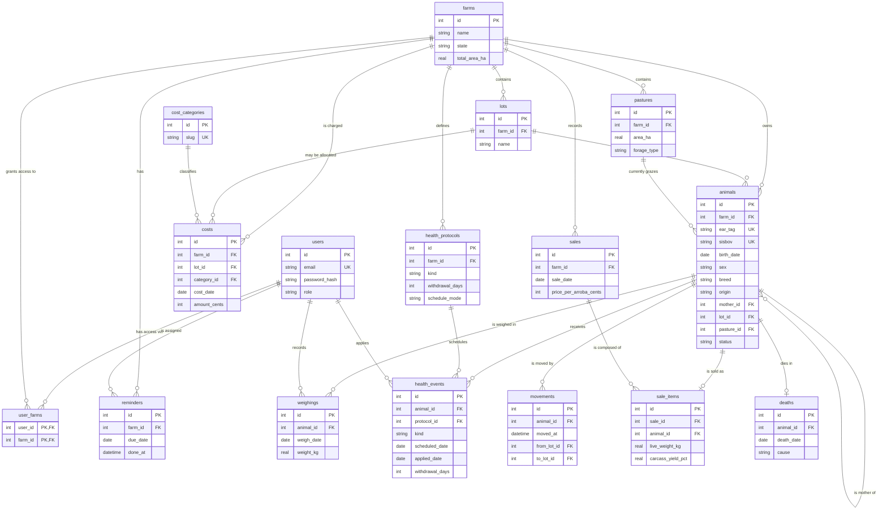

# Step 0 — Baseline Design & Execution Plan

**Project:** GadoManager — sistema de gestão de rebanho bovino de corte
**Date:** 2026-08-03
**Status:** awaiting approval — no implementation code written yet

---

## 0. Why this is a design baseline and not an audit

The original codebase could not be audited because it no longer exists. Six copies of the
project were bulk-deleted from the OneDrive Desktop on 2026-06-25 at ~00:30. The Windows
Recycle Bin retains the directory trees but **zero files and zero bytes** — verified with a
raw `dir /a /s` listing.

| Original folder | Stack indicated by surviving tree | Directories | Files |
| --- | --- | ---: | ---: |
| `gado_manager` | Python (`venv`, `__pycache__`) | 137 | 0 |
| `gado_tcc_site_clean_fixed` | Django (`core/`, `migrations/`, `.venv`) | 2954 | 0 |
| `TCC-3BDS-codex-develop-complete-web-system-for-livestock-management` | Django | 27 | 0 |
| `TCC-3BDS-…-livestock-management-g0r5y0` | Django | 28 | 0 |
| `TCC-3BDS-codex-analyze-project-and-make-improvements` | Django | 162 | 0 |
| `tcc 3bds v2` | Node/Express (`src/`, `public/`, `data/`) | 132 | 0 |

Two recovery paths remain open and are **not** blocked by this document:

1. **OneDrive online recycle bin** — 93-day retention, deletion was 39 days ago, so the
   window closes around 2026-09-26. This is the strongest option.
2. **GitHub** — the `TCC-3BDS-codex-*` folder names are GitHub branch-ZIP naming, implying
   a repository `TCC-3BDS` with `codex/*` branches.

If either recovers the source, this document should be re-derived as a true audit against
the real code. Until then, Step 0 items 1–3 are delivered as *specifications* rather than
*findings*, and item 4 (the issue list) is derived from the defects described in the brief.

---

## 1. Architecture

### 1.1 Stack

| Layer | Choice | Justification for the board |
| --- | --- | --- |
| Runtime | Node.js LTS | Single language across server and browser; no additional runtime to install on an examiner's machine. |
| HTTP | Express 4 | Smallest, most widely documented Node web framework. Explicit middleware chain — the request lifecycle can be drawn on one slide. |
| Database | SQLite via `better-sqlite3` | Zero-install, file-based, fully reproducible. The `.db` file is copied with the project. No server process to configure during a defense. |
| Data access | Parameterized SQL + repository layer | Prepared statements with bound parameters make SQL injection impossible by construction. Every KPI has literal SQL that can be shown and defended line by line. |
| Migrations | Numbered `.sql` files + a ~40-line runner | The schema history is readable SQL, not a generated artifact. |
| Views | EJS server-rendered | No build step, no bundler, no client framework. Works on weak connections; the page arrives complete. |
| Charts | Chart.js, vendored locally | Covers donut, bar, line and stacked bar. Served from `public/vendor/` so the app never depends on a CDN in the field. |
| Auth | `express-session` + `connect-sqlite3` + Argon2id | Argon2id is the current password-hashing recommendation; sessions in SQLite keep the single-file deployment story. |
| Tests | Node's built-in `node:test` | Zero test dependencies. |

**Node.js is not currently installed on this machine.** Install the LTS release from
<https://nodejs.org> before Phase 0. Present toolchain: `git 2.55.0` only.

### 1.2 Directory layout

```
C:\tcc 3bds\
├─ package.json
├─ .env.example                  # PORT, SESSION_SECRET, DB_PATH
├─ README.md
├─ CHANGELOG.md
├─ data/
│  └─ gadomanager.db             # gitignored
├─ docs/
│  ├─ 00-baseline-design.md      # this file
│  ├─ architecture.md
│  ├─ business-rules.md
│  ├─ data-model.md
│  └─ requirements.md
├─ migrations/
│  ├─ 001_initial_schema.sql
│  ├─ 002_indexes.sql
│  └─ …
├─ seeds/
│  └─ demo.js
├─ src/
│  ├─ server.js                  # bootstrap + listen
│  ├─ app.js                     # express app, middleware chain
│  ├─ config/{env,db}.js
│  ├─ middleware/                # auth, csrf, tenant, validate, errors
│  ├─ repositories/              # ALL SQL lives here and nowhere else
│  ├─ services/                  # business rules; no SQL, no req/res
│  ├─ domain/                    # pure functions + constants
│  ├─ lib/{format,safeMath,csv}.js
│  └─ views/                     # EJS: layouts, partials, components, modules
├─ public/{css,js,vendor}/
└─ tests/{unit,integration}/
```

### 1.3 Layering rule

```
routes → services → repositories → SQLite
```

- **Routes** are thin: parse input, validate, call one service, render. No SQL, no arithmetic.
- **Services** hold business rules. They receive plain data and return plain data. No `req`,
  no `res`, no SQL — which is precisely what makes GMD and stocking rate unit-testable.
- **Repositories** are the only place a SQL string may appear. Every statement is prepared
  with bound parameters.
- **Domain** holds pure functions and constants (`UA_KG = 450`, `ARROBA_KG = 15`).

This separation is what allows Priority 1's "write a short proof for each KPI" to be
satisfied: each KPI is one named repository method with one inspectable query, plus one
service function with unit tests.

### 1.4 Request lifecycle

```
request
  → helmet (security headers)
  → session (SQLite-backed)
  → CSRF verification (state-changing methods only)
  → requireLogin
  → resolveTenantScope   ← computes req.scope.farmIds from user_farms
  → requireRole(...)     ← route-specific
  → route handler
      → input validation (server-side, always)
      → service (business rules)
      → repository (prepared statement, farmIds bound)
  → view model
  → EJS render (auto-escaped)
  → response
```

`resolveTenantScope` is the multi-tenant backbone. Every repository method that touches
farm-owned data takes `farmIds` as a bound parameter. There is no code path that reads
animal data without it.

---

## 2. Data model

### 2.1 Conventions

- All dates stored as `TEXT` in ISO `YYYY-MM-DD`. **Never** localized in the database.
  Brazilian `dd/MM/yyyy` formatting happens only in `lib/format.js` at the view layer.
  This alone eliminates an entire class of date-comparison bugs — see issue `BUG-03`.
- All money stored as `INTEGER` in centavos, to avoid floating-point drift on financial sums.
- Weights stored as `REAL` in kilograms.
- Enumerations stored as `TEXT` with a `CHECK` constraint, so invalid states cannot be written.
- Every table carries `created_at` / `updated_at` as ISO datetime text.

### 2.2 Data dictionary

#### `users`
| Column | Type | Key / Constraint | Notes |
| --- | --- | --- | --- |
| id | INTEGER | PK AUTOINCREMENT | |
| name | TEXT | NOT NULL | |
| email | TEXT | NOT NULL, UNIQUE | login identity |
| password_hash | TEXT | NOT NULL | Argon2id |
| role | TEXT | NOT NULL, CHECK in (`admin`,`gerente`,`peao`) | |
| active | INTEGER | NOT NULL DEFAULT 1 | boolean |
| created_at / updated_at | TEXT | NOT NULL | |

#### `farms` (Fazendas)
| Column | Type | Key / Constraint | Notes |
| --- | --- | --- | --- |
| id | INTEGER | PK | |
| name | TEXT | NOT NULL | |
| city | TEXT | | município |
| state | TEXT | CHECK length 2 | UF |
| total_area_ha | REAL | CHECK > 0 | |
| created_at / updated_at | TEXT | NOT NULL | |

#### `user_farms` — multi-tenant join
| Column | Type | Key / Constraint |
| --- | --- | --- |
| user_id | INTEGER | PK part, FK → users.id ON DELETE CASCADE |
| farm_id | INTEGER | PK part, FK → farms.id ON DELETE CASCADE |

The whole isolation guarantee rests on this table. Priority 5's isolation test asserts that
a user with no row here for farm *X* receives zero rows from every animal-facing query.

#### `pastures` (Pastos)
| Column | Type | Key / Constraint | Notes |
| --- | --- | --- | --- |
| id | INTEGER | PK | |
| farm_id | INTEGER | FK → farms.id, NOT NULL | |
| name | TEXT | NOT NULL | |
| area_ha | REAL | NOT NULL, CHECK > 0 | denominator of UA/ha |
| forage_type | TEXT | | e.g. Brachiaria brizantha, Panicum |
| rest_period_days | INTEGER | CHECK >= 0 | período de descanso |
| active | INTEGER | NOT NULL DEFAULT 1 | |

#### `lots` (Lotes)
| Column | Type | Key / Constraint | Notes |
| --- | --- | --- | --- |
| id | INTEGER | PK | |
| farm_id | INTEGER | FK → farms.id, NOT NULL | |
| name | TEXT | NOT NULL | |
| description | TEXT | | purpose, e.g. recria, engorda |
| active | INTEGER | NOT NULL DEFAULT 1 | |

#### `animals` (Animais)
| Column | Type | Key / Constraint | Notes |
| --- | --- | --- | --- |
| id | INTEGER | PK | |
| farm_id | INTEGER | FK → farms.id, NOT NULL | tenant anchor |
| ear_tag | TEXT | NOT NULL, UNIQUE(farm_id, ear_tag) | brinco |
| sisbov | TEXT | UNIQUE, nullable | optional |
| birth_date | TEXT | NOT NULL | ISO |
| sex | TEXT | CHECK in (`M`,`F`) | |
| breed | TEXT | CHECK in (`nelore`,`angus`,`cruzado`) | |
| origin | TEXT | CHECK in (`nascido`,`comprado`) | |
| mother_id | INTEGER | FK → animals.id, nullable | self-reference, births only |
| purchase_date | TEXT | nullable | required when origin = comprado |
| purchase_price_cents | INTEGER | nullable | |
| lot_id | INTEGER | FK → lots.id, nullable | **current** location |
| pasture_id | INTEGER | FK → pastures.id, nullable | **current** location |
| status | TEXT | CHECK in (`ativo`,`vendido`,`morto`,`transferido`) | |
| photo_path | TEXT | nullable | stored outside webroot |
| notes | TEXT | | |
| created_at / updated_at | TEXT | NOT NULL | |

`lot_id` and `pasture_id` are a deliberate denormalization of "current location". The
authoritative history lives in `movements`; these two columns are maintained inside the same
transaction as the movement insert. Justification: dashboard filtering by lote must not
require a correlated subquery over the movement history on every request.

#### `weighings` (Pesagens)
| Column | Type | Key / Constraint | Notes |
| --- | --- | --- | --- |
| id | INTEGER | PK | |
| animal_id | INTEGER | FK → animals.id ON DELETE CASCADE, NOT NULL | |
| weigh_date | TEXT | NOT NULL | UNIQUE(animal_id, weigh_date) |
| weight_kg | REAL | NOT NULL, CHECK > 0 | |
| source | TEXT | CHECK in (`manual`,`lote`) | batch entry flag |
| notes | TEXT | | |
| created_by | INTEGER | FK → users.id | |
| created_at | TEXT | NOT NULL | |

`UNIQUE(animal_id, weigh_date)` prevents the duplicate same-day weighings that corrupt a GMD
denominator (`delta_days = 0`).

#### `health_protocols` (Protocolos sanitários)
| Column | Type | Key / Constraint | Notes |
| --- | --- | --- | --- |
| id | INTEGER | PK | |
| farm_id | INTEGER | FK → farms.id, NOT NULL | |
| name | TEXT | NOT NULL | |
| kind | TEXT | CHECK in (`vacina`,`tratamento`) | |
| product | TEXT | | |
| dose | REAL | | |
| dose_unit | TEXT | | ml, g |
| withdrawal_days | INTEGER | NOT NULL DEFAULT 0 | período de carência |
| schedule_mode | TEXT | CHECK in (`por_idade`,`por_data`) | |
| age_days | INTEGER | nullable | used when schedule_mode = por_idade |
| interval_days | INTEGER | nullable | booster interval |
| active | INTEGER | NOT NULL DEFAULT 1 | |

#### `health_events` (Vacinas + Tratamentos)
| Column | Type | Key / Constraint | Notes |
| --- | --- | --- | --- |
| id | INTEGER | PK | |
| animal_id | INTEGER | FK → animals.id ON DELETE CASCADE, NOT NULL | |
| protocol_id | INTEGER | FK → health_protocols.id, nullable | null = ad-hoc |
| kind | TEXT | CHECK in (`vacina`,`tratamento`), NOT NULL | |
| name | TEXT | NOT NULL | |
| product | TEXT | | |
| dose | REAL | | |
| dose_unit | TEXT | | |
| diagnosis | TEXT | nullable | treatments only |
| scheduled_date | TEXT | NOT NULL | `data_prevista` |
| applied_date | TEXT | nullable | `data_aplicacao` |
| applicator_user_id | INTEGER | FK → users.id, nullable | |
| withdrawal_days | INTEGER | NOT NULL DEFAULT 0 | copied from protocol at scheduling |
| batch_number | TEXT | | lote do produto |
| notes | TEXT | | |

> **Deviation from the brief — please confirm.** `Vacinas` and `Tratamentos` are two navbar
> modules but one table with a `kind` discriminator. The columns are identical, the overdue
> rule is identical, and the carência rule is identical. Two tables would mean two copies of
> the overdue query — and divergence between two copies of that query is one of the leading
> hypotheses for the `72 vac / 8 trat` anomaly. The UI still presents two separate modules;
> they are two filtered views over one table. Say the word if you want them physically split.

#### `movements` (Movimentações)
| Column | Type | Key / Constraint | Notes |
| --- | --- | --- | --- |
| id | INTEGER | PK | |
| animal_id | INTEGER | FK → animals.id, NOT NULL | |
| moved_at | TEXT | NOT NULL | |
| from_farm_id / to_farm_id | INTEGER | FK → farms.id, nullable | |
| from_lot_id / to_lot_id | INTEGER | FK → lots.id, nullable | |
| from_pasture_id / to_pasture_id | INTEGER | FK → pastures.id, nullable | |
| reason | TEXT | | |
| created_by | INTEGER | FK → users.id | |

#### `sales` (Vendas) and `sale_items`
A sale is one buyer, one date, one negotiated price per arroba, covering many animals.
Splitting the header from the items is what makes per-animal profit computable.

`sales`: id, farm_id (FK), buyer_name, sale_date, price_per_arroba_cents, notes, created_by.

`sale_items`: id, sale_id (FK ON DELETE CASCADE), animal_id (FK, UNIQUE — an animal can be
sold once), live_weight_kg (CHECK > 0), carcass_yield_pct (CHECK between 40 and 65),
arrobas (REAL), gross_value_cents (INTEGER).

#### `deaths` (Mortes)
id, animal_id (FK, UNIQUE), death_date, cause, notes, created_by.

Kept separate from `animals.status` so that mortality is reportable and auditable rather than
inferred from a status flag.

#### `cost_categories` and `costs` (Custos)
`cost_categories` is seeded with exactly the five categories named in the brief:
`alimentacao`, `sanidade`, `mao_de_obra`, `infraestrutura`, `outros`.

`costs`: id, farm_id (FK, NOT NULL), lot_id (FK, nullable — null means farm-wide),
category_id (FK, NOT NULL), cost_date (TEXT NOT NULL), amount_cents (INTEGER NOT NULL
CHECK > 0), description, is_recurring (INTEGER), recurrence_months (INTEGER nullable),
created_by, created_at.

#### `reminders` (Lembretes)
id, farm_id (FK), title, description, due_date, assigned_user_id (FK, nullable),
done_at (nullable), recurrence (CHECK in `nenhuma`,`semanal`,`mensal`,`anual`),
created_by, created_at.

### 2.3 ER diagram



### 2.4 Indexes

Created in `002_indexes.sql`, targeting exactly the dashboard access paths:

| Index | Supports |
| --- | --- |
| `animals(farm_id, status)` | every scoped count, the status donut |
| `animals(lot_id)`, `animals(pasture_id)` | lote/pasto filters, stocking rate |
| `weighings(animal_id, weigh_date DESC)` | latest-weighing window function, GMD pair |
| `weighings(weigh_date)` | period filter on weight evolution chart |
| `health_events(applied_date, scheduled_date)` | the overdue / due-in-30 query |
| `health_events(animal_id)` | animal timeline |
| `costs(farm_id, cost_date)` | custos do mês, stacked cost chart |
| `movements(animal_id, moved_at)` | animal timeline |
| `sale_items(animal_id)` | profit per animal |

---

## 3. KPI specifications and their proofs

Every query below is scoped by `a.farm_id IN (:farmIds)` where `:farmIds` comes from
`req.scope`. That clause is omitted from the snippets only for readability — it is never
omitted in code.

### 3.1 Root-cause hypotheses for the reported anomalies

**`Atrasadas: 72 vac` and `Atrasados: 8 trat` across 34 animals.**
72 overdue doses across 34 animals is ~2.1 per animal, which is *not* inherently impossible —
one animal can carry several overdue doses. The number looks wrong mainly because the card
reports doses while the reader is thinking in animals. Ranked hypotheses:

1. **Missing `a.status = 'ativo'` filter** — sold and dead animals keep generating alerts.
   The brief explicitly forbids this, which suggests it is what is happening.
2. **Missing `applied_date IS NULL` filter** — already-applied doses counted as overdue.
3. **Join fan-out** — joining `animals` and then `lots`/`pastures` without `DISTINCT`
   multiplies rows when an animal matches several joined rows.
4. **Seed artifact** — the seeder scheduled every protocol for every animal in the past.

The design answers all four: one query, one join to `animals` (many-to-one, so no fan-out
possible), both filters mandatory, and the card reports **both** doses and distinct animals.

**`Custos do mês: R$ 0,00`.** Two independent defects, commonly co-occurring:

1. **A date-format mismatch.** If `cost_date` is stored as `dd/MM/yyyy` text — very common in
   Brazilian student projects — then any range comparison or `strftime('%Y-%m', …)` silently
   matches nothing. Fixed by storing ISO `YYYY-MM-DD` everywhere (§2.1).
2. **Rendering zero instead of "no data".** `R$ 0,00` and "nothing recorded" are different
   facts and must render differently. See §3.8.

### 3.2 Animais (total) and Ativos

```sql
SELECT
  COUNT(*)                                          AS total,
  SUM(CASE WHEN a.status = 'ativo' THEN 1 ELSE 0 END) AS ativos
FROM animals a
WHERE a.farm_id IN (:farmIds);
```

*Proof:* one row per animal, no joins, therefore no fan-out. `total` is the herd on record;
`ativos` is the subset still in the herd.

### 3.3 Peso médio (última pesagem)

```sql
WITH latest AS (
  SELECT w.animal_id, w.weight_kg,
         ROW_NUMBER() OVER (
           PARTITION BY w.animal_id
           ORDER BY w.weigh_date DESC, w.id DESC
         ) AS rn
  FROM weighings w
  JOIN animals a ON a.id = w.animal_id
  WHERE a.farm_id IN (:farmIds)
    AND a.status = 'ativo'
)
SELECT AVG(weight_kg) AS avg_weight_kg,
       COUNT(*)       AS n_animals
FROM latest
WHERE rn = 1;
```

*Proof:* `ROW_NUMBER()` partitioned per animal, filtered to `rn = 1`, yields exactly one row
per animal — the most recent weighing. `ORDER BY … , w.id DESC` breaks same-date ties
deterministically. Inactive animals are excluded by the `status` filter, as required.
`n_animals` is the honest denominator and is displayed in the tooltip. When `n_animals = 0`
the card renders `—`, never `0,0 kg`.

### 3.4 GMD médio (ganho médio diário)

```sql
WITH ranked AS (
  SELECT w.animal_id, w.weigh_date, w.weight_kg,
         ROW_NUMBER() OVER (
           PARTITION BY w.animal_id
           ORDER BY w.weigh_date DESC, w.id DESC
         ) AS rn
  FROM weighings w
  JOIN animals a ON a.id = w.animal_id
  WHERE a.farm_id IN (:farmIds)
    AND a.status = 'ativo'
),
pairs AS (
  SELECT curr.animal_id,
         curr.weight_kg - prev.weight_kg                     AS delta_kg,
         julianday(curr.weigh_date) - julianday(prev.weigh_date) AS delta_days
  FROM ranked curr
  JOIN ranked prev
    ON prev.animal_id = curr.animal_id
   AND prev.rn = 2
  WHERE curr.rn = 1
)
SELECT AVG(delta_kg / delta_days) AS avg_gmd_kg_day,
       COUNT(*)                   AS n_animals
FROM pairs
WHERE delta_days > 0;
```

*Proof of the exclusion rule:* an animal with exactly one weighing has no row with `rn = 2`,
so the inner join produces no row for it in `pairs`. It is therefore **excluded from both the
numerator and the denominator** — it is not counted as zero. This is the specific behaviour
the brief demands, and it is enforced by the join rather than by application logic.

*Proof of division safety:* `UNIQUE(animal_id, weigh_date)` makes two weighings on the same
date impossible, and `WHERE delta_days > 0` rejects any residual case. Division by zero
cannot occur.

On-screen tooltip (pt-BR):

> GMD = (peso mais recente − peso anterior) ÷ dias entre as duas pesagens.
> A média considera apenas animais ativos com pelo menos duas pesagens (n = X).
> Animais com uma única pesagem são excluídos do cálculo, não contados como zero.

### 3.5 Vacinas / tratamentos atrasados e a vencer

```sql
SELECT
  SUM(CASE WHEN he.kind = 'vacina'     AND he.scheduled_date <  :today THEN 1 ELSE 0 END) AS overdue_vaccine_doses,
  SUM(CASE WHEN he.kind = 'tratamento' AND he.scheduled_date <  :today THEN 1 ELSE 0 END) AS overdue_treatment_doses,
  COUNT(DISTINCT CASE WHEN he.scheduled_date < :today THEN he.animal_id END)              AS overdue_animals,
  SUM(CASE WHEN he.scheduled_date >= :today
            AND he.scheduled_date <= :in30 THEN 1 ELSE 0 END)                             AS due_next_30_doses
FROM health_events he
JOIN animals a ON a.id = he.animal_id
WHERE he.applied_date IS NULL
  AND a.status = 'ativo'
  AND a.farm_id IN (:farmIds);
```

*Proof:* the brief's three conditions are all present and mandatory — `scheduled_date < today`,
`applied_date IS NULL`, `a.status = 'ativo'`. The single join is many-to-one (`health_events`
→ `animals`), so the result set has exactly one row per health event and fan-out is
structurally impossible. Sold, dead and transferred animals are filtered out, so they can
never raise an alert.

`overdue_animals` is the fix for the readability problem: the alerts panel reads
**"72 doses de vacina atrasadas em 41 animais"**, which is unambiguous, instead of a bare
red badge whose denominator the reader has to guess.

### 3.6 Sem pesagem (60 dias)

```sql
SELECT
  COUNT(*) AS without_recent_weighing,
  SUM(CASE WHEN NOT EXISTS (
        SELECT 1 FROM weighings w WHERE w.animal_id = a.id
      ) THEN 1 ELSE 0 END) AS never_weighed
FROM animals a
WHERE a.farm_id IN (:farmIds)
  AND a.status = 'ativo'
  AND NOT EXISTS (
    SELECT 1 FROM weighings w
    WHERE w.animal_id = a.id
      AND w.weigh_date >= date(:today, '-60 days')
  );
```

*Proof:* the outer `NOT EXISTS` covers both "weighed, but too long ago" and "never weighed",
which is correct — both populations need weighing. The card breaks the total down so the two
are distinguishable, because they demand different actions.

### 3.7 Custos do mês

```sql
SELECT COALESCE(SUM(c.amount_cents), 0) AS total_cents,
       COUNT(*)                         AS n_entries
FROM costs c
WHERE c.farm_id IN (:farmIds)
  AND c.cost_date >= date(:today, 'start of month')
  AND c.cost_date <  date(:today, 'start of month', '+1 month');
```

*Proof:* a half-open interval `[start of month, start of next month)` includes every day of
the month regardless of length and cannot double-count a boundary date. ISO storage makes the
text comparison equivalent to a date comparison.

`n_entries` is what distinguishes the two cases the brief cares about:

- `n_entries = 0` → render `—` plus the empty state *"Nenhum custo lançado neste mês"* with a
  **Lançar custo** action.
- `n_entries > 0` and `total_cents = 0` → render `R$ 0,00`, because that is the true answer.

### 3.8 Safe arithmetic

`lib/safeMath.js` exposes `safeDivide(numerator, denominator)`, returning `null` when the
denominator is `0`, `null` or `undefined`, or when the result is not finite. `lib/format.js`
renders `null` as an em dash `—`. Consequently `NaN`, `Infinity` and misleading zeros cannot
reach a template: the only way to display a number is through a formatter that already
handles the empty case.

---

## 4. Issue register

Derived from the defects described in the brief plus the risks inherent in the rebuild.
Each item names the phase that closes it.

### Bugs
| ID | Issue | Phase |
| --- | --- | --- |
| BUG-01 | Overdue counts include non-active animals — sold/dead animals raise alerts | 4 |
| BUG-02 | Overdue counts likely omit `applied_date IS NULL`, counting applied doses | 4 |
| BUG-03 | `Custos do mês` returns 0 — date comparison against non-ISO stored dates | 1, 4 |
| BUG-04 | Possible join fan-out inflating dose counts | 4 |
| BUG-05 | GMD averages single-weighing animals as zero, deflating the herd figure | 4 |
| BUG-06 | `Peso médio` may average all weighings rather than the latest per animal | 4 |
| BUG-07 | `R$ 0,00` rendered where the truth is "no data" | 4, 5 |

### Data integrity
| ID | Issue | Phase |
| --- | --- | --- |
| DAT-01 | No uniqueness on `brinco` per farm — duplicate ear tags | 1 |
| DAT-02 | Duplicate same-day weighings break the GMD denominator | 1 |
| DAT-03 | Enumerated fields unconstrained — invalid status values writable | 1 |
| DAT-04 | Current lote/pasto can drift from movement history if not transactional | 10 |
| DAT-05 | Money as floating point accumulates error across sums | 1 |
| DAT-06 | An animal can be sold twice without a uniqueness constraint | 1, 11 |
| DAT-07 | No FK enforcement — SQLite needs `PRAGMA foreign_keys = ON` per connection | 0 |

### Security
| ID | Issue | Phase |
| --- | --- | --- |
| SEC-01 | SQL injection wherever queries are string-concatenated | 1 (by construction) |
| SEC-02 | Passwords not hashed with a modern KDF | 2 |
| SEC-03 | No CSRF protection on state-changing requests | 2 |
| SEC-04 | XSS via unescaped output | 2 |
| SEC-05 | No server-side authorization — hidden buttons are not access control | 2 |
| SEC-06 | Cross-tenant data leakage between farm accounts | 2 |
| SEC-07 | Unrestricted file upload (MIME type, size, storage location) | 8 |
| SEC-08 | Missing security headers and session hardening | 2 |

### UX / UI
| ID | Issue | Phase |
| --- | --- | --- |
| UX-01 | Donut chart oversized; charts dictate page height | 6 |
| UX-02 | Bar chart leaves dead space; no axis titles, units or value labels | 6 |
| UX-03 | Red badges are not actionable — no path to the records they describe | 5 |
| UX-04 | KPI cards are not clickable | 5 |
| UX-05 | No global filters; no filter state in the URL | 5 |
| UX-06 | No loading or empty states | 5 |
| UX-07 | Generic Bootstrap look, no deliberate identity | 7 |
| UX-08 | Not usable on mobile — tables overflow, navbar unusable | 7 |
| UX-09 | pt-BR formatting inconsistent and scattered across views | 7 |
| UX-10 | No accessibility: contrast, focus, labels, chart alternatives | 7 |
| UX-11 | No confirmation on destructive actions, no feedback on success | 7 |

### Performance
| ID | Issue | Phase |
| --- | --- | --- |
| PERF-01 | No indexes on FKs or dashboard date columns | 1 |
| PERF-02 | N+1 queries rendering lists with related data | 12 |
| PERF-03 | Dashboard issues many small queries instead of a few aggregates | 4 |
| PERF-04 | No pagination — full-table reads on list screens | 8 |

### Missing features
Everything in Priority 3, plus protocol templates, carência tracking, batch weighing,
stocking rate, profit per animal, CSV export and bulk actions. Phases 8–11.

### Code quality
| ID | Issue | Phase |
| --- | --- | --- |
| CQ-01 | Business logic in route handlers / templates rather than a service layer | 0 |
| CQ-02 | No automated tests for domain formulas | 4, 12 |
| CQ-03 | No migration history — schema drift between machines | 0 |
| CQ-04 | Formatting duplicated ad hoc across views | 7 |
| CQ-05 | No documented domain rules for the written thesis | 13 |

---

## 5. Execution plan

Effort is in focused working hours. One logical change per commit, English commit messages.

| Phase | Scope | Effort | Closes |
| --- | --- | ---: | --- |
| **0** | Foundation: Node install check, `package.json`, Express skeleton, SQLite connection with `foreign_keys` + WAL pragmas, migration runner, `lib/format.js`, `lib/safeMath.js`, base layout, error handling | 4–6 h | CQ-01, CQ-03, DAT-07 |
| **1** | Full schema as numbered migrations, all CHECK constraints, all indexes, cost categories seeded | 4–5 h | DAT-01…06, SEC-01, PERF-01, BUG-03 |
| **2** | Auth (Argon2id), sessions, roles `admin`/`gerente`/`peao`, `resolveTenantScope`, CSRF, helmet, output escaping — **plus the multi-tenant isolation test** | 6–8 h | SEC-02…06, SEC-08 |
| **3** | Demo seed: 2 farms, 5 lotes, 4 pastos, 130 animals, 18 months of weighings at 60–90 day intervals, vaccination calendar with deliberate overdue records, births, purchases, sales, deaths, monthly costs | 5–7 h | — |
| **4** | KPI services + repository queries from §3, unit tests per formula, `docs/business-rules.md` proofs | 6–8 h | BUG-01…07, PERF-03, CQ-02 |
| **5** | Dashboard v1: KPI cards (clickable), global URL-persisted filters, actionable alerts panel, skeleton + empty states | 8–10 h | UX-03…06 |
| **6** | Charts: donut with legend/centre total, bar with axis titles + value labels + average reference line, weight evolution line, GMD curve, stacked costs, herd composition — each with an ARIA text-alternative table | 8–10 h | UX-01, UX-02 |
| **7** | Design system: spacing/type scale, semantic palette, shared components, mobile-first responsive (tables → cards under 768px, hamburger nav, 44px targets), centralized pt-BR formatting, WCAG AA, confirmations + toasts | 8–10 h | UX-07…11, CQ-04 |
| **8** | `Animais` module **plus the reusable list infrastructure** built once here: server-side pagination, sorting, search, column filters, CSV export, bulk-action bar. Animal detail page with timeline and weight curve, photo upload with MIME/size validation | 16–20 h | SEC-07, PERF-04 |
| **9** | `Pesagens` (keyboard-first batch entry, GMD recalculation, outlier detection), `Lotes`, `Pastos` (UA/ha stocking rate + overgrazing warning), `Fazendas` | 12–15 h | — |
| **10** | `Vacinas`/`Tratamentos` + protocol templates + carência enforcement, `Movimentações` with atomic location update | 12–15 h | DAT-04 |
| **11** | `Vendas` (arroba pricing, carcass yield, profit per animal), `Custos` (allocation, recurring, cost per animal/month), `Lembretes` | 10–12 h | — |
| **12** | Hardening: full server-side validation, domain rule enforcement, N+1 elimination with before/after query counts and page timings, remaining tests | 8–10 h | PERF-02, CQ-02 |
| **13** | TCC deliverables: `README.md`, `docs/architecture.md`, `docs/data-model.md`, `docs/business-rules.md`, `docs/requirements.md` with use-case diagram, `CHANGELOG.md`, screenshots | 6–8 h | CQ-05 |

**Total: 104–134 hours.**

Phases 0–4 are the critical path: they are what make the dashboard *correct*, which is
Priority 1 and the part most likely to be challenged in a defense. Phases 5–7 make it
*defensible visually*. Phases 8–11 are breadth. Phase 12–13 are the write-up.

---

## 6. Open questions

None of these block Phase 0. They are ordered by the phase that first needs an answer.

1. **Vacinas/Tratamentos as one table (§2.2).** Confirm the deviation, or ask for two tables.
   *Needed by Phase 1.*
2. **Meaning of `status = 'transferido'`.** My assumption: an internal move between your own
   farms keeps `status = 'ativo'` and is recorded in `movements`; `transferido` means the
   animal left the managed herd to a third party without being a sale. Confirm.
   *Needed by Phase 1.*
3. **Vaccination calendar realism.** Brazil was recognised free of foot-and-mouth disease
   *without vaccination* in 2025, so a 2026 seed dataset built around routine aftosa campaigns
   would be an anachronism an examiner could catch. I propose basing the calendar on
   brucelose (females 3–8 months), clostridioses, raiva where applicable, plus vermifugação
   as treatments. Please confirm against your thesis references and tell me the **UF** of the
   two farms, since the calendar is state-dependent. *Needed by Phase 3.*
4. **Arroba convention.** I will use 1 @ = 15 kg of **carcass** weight, so
   `arrobas = live_weight_kg × carcass_yield_pct / 100 / 15`, with price per @ applied to
   carcass arrobas. This is the standard convention but the board will check it.
   *Needed by Phase 11.*
5. **Offline capability.** The brief says users are "sometimes with poor connectivity" but
   never asks for offline mode. Server-rendered pages are light but still require a
   connection. Do you want genuine offline support (service worker + queued weighing
   submissions), or is a lightweight online app sufficient? The former is a substantial
   feature and would need its own phase. *Needed by Phase 9.*
6. **Death causes.** Fixed list or free text? *Needed by Phase 1.*
