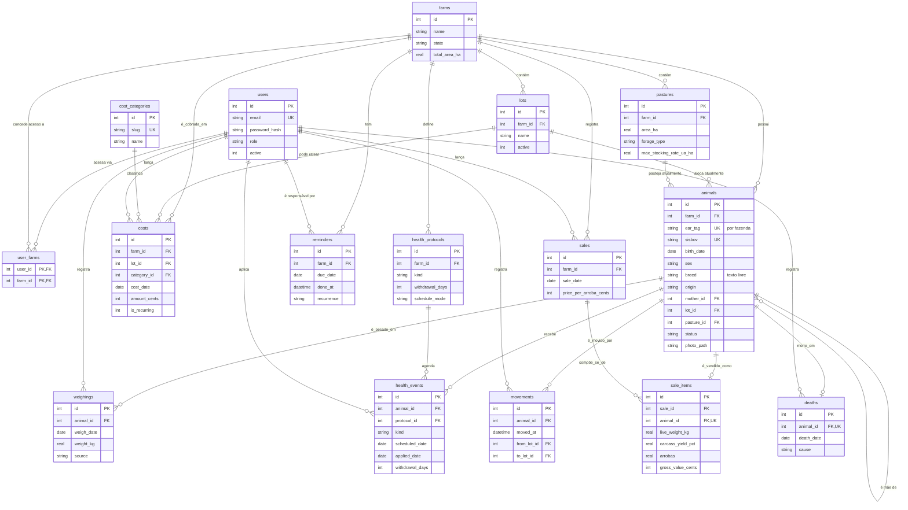

# Modelo de dados

Este documento descreve o schema **como ele existe hoje** no banco de dados,
extraído diretamente das migrações aplicadas (`migrations/001` a `005`) —
não é um plano, é a fonte da verdade lida da própria definição das tabelas.
Quando este documento e uma migração divergirem no futuro, a migração está
certa; atualize este arquivo.

Convenções gerais, ver [`business-rules.md` §1](business-rules.md):
datas como `TEXT` ISO `YYYY-MM-DD`, dinheiro como `INTEGER` em centavos,
peso como `REAL` em quilogramas, enumerações fechadas por `CHECK`.

---

## Diagrama entidade-relacionamento

---

## Dicionário de dados

### `users` — contas do sistema

| Coluna | Tipo | Restrição | Observação |
| --- | --- | --- | --- |
| id | INTEGER | PK | |
| name | TEXT | NOT NULL | |
| email | TEXT | NOT NULL, UNIQUE | identidade de login, normalizada para minúsculas antes de comparar |
| password_hash | TEXT | NOT NULL | Argon2id, nunca a senha em texto puro |
| role | TEXT | CHECK IN (`admin`, `gerente`, `peao`) | ver [`requirements.md`](requirements.md) para a matriz de capacidades |
| active | INTEGER | NOT NULL DEFAULT 1 | uma conta desativada é rejeitada no login e perde a sessão já aberta na próxima requisição |
| created_at / updated_at | TEXT | NOT NULL | |

Uma conta pode nascer de duas formas: `POST /registrar` (pública, sempre cria
`role='peao'` e zero fazendas) ou `scripts/create-user.js` (linha de comando,
usado para criar o primeiro administrador de uma instalação nova).

### `farms` (Fazendas)

| Coluna | Tipo | Restrição | Observação |
| --- | --- | --- | --- |
| id | INTEGER | PK | |
| name | TEXT | NOT NULL | |
| city | TEXT | | município |
| state | TEXT | CHECK length = 2 | UF |
| total_area_ha | REAL | CHECK > 0 | |

### `user_farms` — junção multi-tenant

| Coluna | Tipo | Restrição |
| --- | --- | --- |
| user_id | INTEGER | PK parte, FK → users.id ON DELETE CASCADE |
| farm_id | INTEGER | PK parte, FK → farms.id ON DELETE CASCADE |

Toda a garantia de isolamento entre contas repousa nesta tabela: um usuário
sem linha aqui para a fazenda X não lê nenhum dado dessa fazenda, em nenhuma
tela — ver `docs/architecture.md#multi-tenancy`. `tests/integration/tenantIsolation.test.js`
e `tests/integration/crossTenantAccess.test.js` verificam isso automaticamente.

### `pastures` (Pastos)

| Coluna | Tipo | Restrição | Observação |
| --- | --- | --- | --- |
| id | INTEGER | PK | |
| farm_id | INTEGER | FK, NOT NULL | |
| name | TEXT | NOT NULL, UNIQUE(farm_id, name) | |
| area_ha | REAL | NOT NULL, CHECK > 0 | denominador da taxa de lotação (UA/ha) |
| forage_type | TEXT | | ex.: Brachiaria brizantha, Panicum |
| rest_period_days | INTEGER | CHECK ≥ 0 | período de descanso |
| max_stocking_rate_ua_ha | REAL | CHECK > 0, opcional | capacidade de suporte declarada pelo usuário — NULL significa "não informada", e a interface reporta a taxa calculada sem julgá-la (migração 004) |
| active | INTEGER | NOT NULL DEFAULT 1 | desativar em vez de excluir, preserva histórico |

### `lots` (Lotes)

| Coluna | Tipo | Restrição | Observação |
| --- | --- | --- | --- |
| id | INTEGER | PK | |
| farm_id | INTEGER | FK, NOT NULL | |
| name | TEXT | NOT NULL, UNIQUE(farm_id, name) | |
| description | TEXT | | finalidade, ex.: recria, engorda |
| active | INTEGER | NOT NULL DEFAULT 1 | |

### `animals` (Animais)

| Coluna | Tipo | Restrição | Observação |
| --- | --- | --- | --- |
| id | INTEGER | PK | |
| farm_id | INTEGER | FK, NOT NULL | âncora do tenant |
| ear_tag | TEXT | NOT NULL, UNIQUE(farm_id, ear_tag) | brinco — único por fazenda, não globalmente |
| sisbov | TEXT | UNIQUE, opcional | rastreabilidade nacional |
| birth_date | TEXT | NOT NULL, ISO | |
| sex | TEXT | CHECK IN (`M`, `F`) | |
| breed | TEXT | CHECK `length(trim(breed))` entre 1 e 60 | **texto livre**, não uma lista fechada (migração 005) — qualquer raça ou cruzamento é aceito; a interface oferece sugestões conhecidas via `<datalist>`, mas não restringe a elas |
| origin | TEXT | CHECK IN (`nascido`, `comprado`) | |
| mother_id | INTEGER | FK → animals.id, opcional | autorreferência, só para nascidos na fazenda |
| purchase_date | TEXT | obrigatório quando origin = comprado | |
| purchase_price_cents | INTEGER | CHECK ≥ 0, opcional | |
| lot_id / pasture_id | INTEGER | FK, opcionais | localização **atual** — denormalizada de propósito, ver nota abaixo |
| status | TEXT | CHECK IN (`ativo`, `vendido`, `morto`, `transferido`) | |
| photo_path | TEXT | opcional | armazenada fora do webroot, servida só por rota autenticada |
| notes | TEXT | | |

`lot_id`/`pasture_id` são a localização atual, mantida na mesma transação de
cada movimentação — o histórico completo e auditável vive em `movements`.
Isso evita que filtrar por lote no painel precise de uma subconsulta
correlacionada sobre todo o histórico de movimentações a cada requisição.

### `weighings` (Pesagens)

| Coluna | Tipo | Restrição | Observação |
| --- | --- | --- | --- |
| id | INTEGER | PK | |
| animal_id | INTEGER | FK ON DELETE CASCADE, NOT NULL | |
| weigh_date | TEXT | NOT NULL, UNIQUE(animal_id, weigh_date) | uma pesagem por animal por dia |
| weight_kg | REAL | NOT NULL, CHECK > 0 | |
| source | TEXT | CHECK IN (`manual`, `lote`) | indica se veio da entrada em lote (teclado) |
| created_by | INTEGER | FK → users.id | |

`UNIQUE(animal_id, weigh_date)` existe especificamente para impedir que duas
pesagens no mesmo dia zerem o denominador da fórmula de GMD.

### `health_protocols` (Protocolos sanitários)

| Coluna | Tipo | Restrição | Observação |
| --- | --- | --- | --- |
| id | INTEGER | PK | |
| farm_id | INTEGER | FK, NOT NULL | |
| kind | TEXT | CHECK IN (`vacina`, `tratamento`) | |
| withdrawal_days | INTEGER | NOT NULL DEFAULT 0 | período de carência do produto |
| schedule_mode | TEXT | CHECK IN (`por_idade`, `por_data`) | como as doses são agendadas |
| age_days | INTEGER | obrigatório quando schedule_mode = por_idade | |
| interval_days | INTEGER | opcional | intervalo entre reforços |
| active | INTEGER | NOT NULL DEFAULT 1 | |

**Dado, não código, de propósito.** O calendário sanitário (quais protocolos
existem, com que idade/intervalo, qual carência) é editável pela tela
`/protocolos`, nunca fixado no código-fonte. A razão: os protocolos
realmente aplicáveis dependem da UF e mudam com a legislação — fixá-los no
código seria inventar conhecimento de domínio que nem o time do projeto tem
como validar sem a bibliografia certa. Os dados de demonstração em
`seeds/demo.js` são **provisórios** e assim rotulados na própria interface.

### `health_events` (Vacinas + Tratamentos)

| Coluna | Tipo | Restrição | Observação |
| --- | --- | --- | --- |
| id | INTEGER | PK | |
| animal_id | INTEGER | FK ON DELETE CASCADE, NOT NULL | |
| protocol_id | INTEGER | FK, opcional | NULL = evento avulso, fora de um protocolo |
| kind | TEXT | CHECK IN (`vacina`, `tratamento`) | |
| scheduled_date | TEXT | NOT NULL | data prevista |
| applied_date | TEXT | opcional | NULL = ainda não aplicada; combinado com `scheduled_date` e o status do animal, define inteiramente "atrasado" |
| withdrawal_days | INTEGER | NOT NULL DEFAULT 0 | copiado do protocolo no momento do agendamento, para que uma edição posterior do protocolo não reescreva retroativamente uma carência já cumprida |
| applicator_user_id | INTEGER | FK → users.id, opcional | |

**Uma tabela, dois módulos de navegação.** Vacinas e Tratamentos aparecem
como itens separados no menu, mas são a mesma tabela filtrada por `kind`. As
colunas, a regra de atraso e a regra de carência são idênticas para os dois;
duas tabelas físicas significariam duas cópias da mesma consulta de atraso,
e divergência entre essas cópias era uma das principais hipóteses para a
anomalia original do sistema (72 doses de vacina em 34 animais).

### `movements` (Movimentações)

| Coluna | Tipo | Restrição | Observação |
| --- | --- | --- | --- |
| id | INTEGER | PK | |
| animal_id | INTEGER | FK, NOT NULL | |
| moved_at | TEXT | NOT NULL | |
| from_lot_id / to_lot_id | INTEGER | FK, opcionais | |
| from_pasture_id / to_pasture_id | INTEGER | FK, opcionais | |
| from_farm_id / to_farm_id | INTEGER | FK, opcionais | movimentação entre fazendas do mesmo usuário |

Cada inserção em `movements` acontece na mesma transação que atualiza
`animals.lot_id`/`pasture_id`, para que a localização atual nunca divirja do
histórico que a originou.

### `sales` (Vendas) e `sale_items`

Uma venda é um comprador, uma data e um preço de arroba negociado, cobrindo
vários animais. Separar cabeçalho de itens é o que torna o lucro por animal
computável.

`sales`: id, farm_id (FK), buyer_name, sale_date, price_per_arroba_cents,
notes, created_by.

| Coluna (`sale_items`) | Tipo | Restrição | Observação |
| --- | --- | --- | --- |
| sale_id | INTEGER | FK ON DELETE CASCADE | |
| animal_id | INTEGER | FK, **UNIQUE** | um animal só pode ser vendido uma vez |
| live_weight_kg | REAL | CHECK > 0 | |
| carcass_yield_pct | REAL | CHECK entre 40 e 65 | fora dessa faixa é erro de digitação, não um animal real |
| arrobas | REAL | CHECK > 0 | derivado, mas armazenado — ver nota |
| gross_value_cents | INTEGER | CHECK ≥ 0 | |

`arrobas` e `gross_value_cents` são **calculados no momento da venda e
gravados**, não recalculados a cada leitura — uma venda histórica não deve
ser silenciosamente restatada se a constante de conversão (1 @ = 15 kg de
carcaça) for revisada no futuro.

### `deaths` (Mortes)

id, animal_id (FK, **UNIQUE**), death_date, cause (CHECK IN `doenca`,
`acidente`, `predador`, `parto`, `desconhecida`, `outra`), notes, created_by.

Mantida separada de `animals.status` para que a mortalidade seja reportável
e auditável em vez de inferida de uma flag.

### `cost_categories` e `costs` (Custos)

`cost_categories` vem semeada com cinco categorias fixas: `alimentacao`,
`sanidade`, `mao_de_obra`, `infraestrutura`, `outros` (migração 003).

| Coluna (`costs`) | Tipo | Restrição | Observação |
| --- | --- | --- | --- |
| farm_id | INTEGER | FK, NOT NULL | |
| lot_id | INTEGER | FK, opcional | NULL = custo da fazenda inteira, não de um lote |
| category_id | INTEGER | FK, NOT NULL | |
| cost_date | TEXT | NOT NULL, ISO | |
| amount_cents | INTEGER | CHECK > 0 | |
| is_recurring | INTEGER | CHECK IN (0,1) | |
| recurrence_months | INTEGER | obrigatório quando is_recurring = 1 | |

Um custo recorrente **se expande em N linhas independentes** no momento do
cadastro (`costService.expandRecurrence`, teto de 60 ocorrências) — não é
uma regra recalculada a cada leitura, então excluir uma ocorrência nunca
afeta as demais.

### `reminders` (Lembretes)

id, farm_id (FK), title, due_date, assigned_user_id (FK, opcional), done_at
(NULL = pendente), recurrence (CHECK IN `nenhuma`, `semanal`, `mensal`,
`anual`), created_by.

Uma recorrência avança por meses/semanas de calendário
(`addMonths`/`addDays`), não por uma contagem fixa de dias — evita deriva de
data em meses de duração diferente.

---

## Índices

Todos criados em `002_indexes.sql`, cada um justificado por um caminho de
acesso real do painel ou de uma tela de listagem (nenhum índice especulativo):

| Índice | Sustenta |
| --- | --- |
| `animals(farm_id, status)` | toda contagem com escopo, o donut de status |
| `animals(lot_id)`, `animals(pasture_id)` | filtros de lote/pasto, taxa de lotação |
| `animals(birth_date)` | composição do rebanho por faixa etária |
| `animals(mother_id)` | listar a prole de um animal na ficha |
| `weighings(animal_id, weigh_date DESC)` | janela da última pesagem, par do GMD |
| `weighings(weigh_date)` | filtro de período no gráfico de evolução de peso |
| `health_events(applied_date, scheduled_date)` | consulta de atraso/a-vencer |
| `health_events(animal_id, scheduled_date)` | linha do tempo do animal |
| `health_events(kind, scheduled_date)` | separação Vacinas × Tratamentos |
| `costs(farm_id, cost_date)`, `costs(lot_id, cost_date)`, `costs(category_id, cost_date)` | custos do mês, gráfico empilhado por categoria |
| `movements(animal_id, moved_at DESC)` | linha do tempo do animal |
| `sales(farm_id, sale_date DESC)`, `sale_items(sale_id)` | lucro por animal |
| `reminders(farm_id, done_at, due_date)`, `reminders(assigned_user_id, done_at)` | widget de próximos lembretes |
| `user_farms(farm_id)` | resolução de escopo do tenant |

A medição de custo de consulta que confirma que nenhum destes caminhos sofre
de N+1 está registrada no `CHANGELOG.md`, seção "Phase 12".
